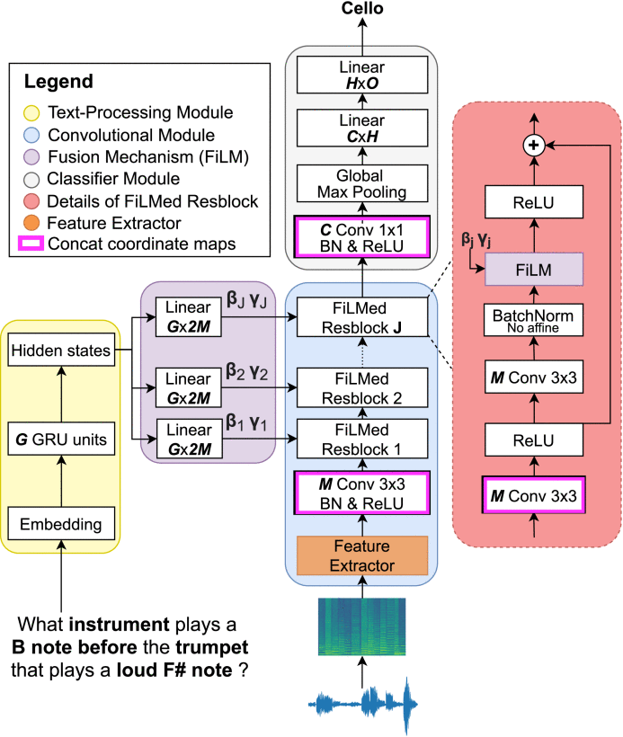
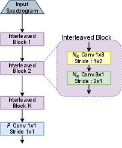
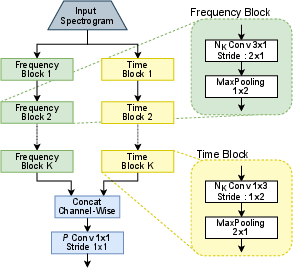

# A Neural Architecture for Acoustic Question Answering



This repository contains the code used in the experiments for the paper (DOI [10.1109/TPAMI.2022.3194311](https://doi.org/10.1109/TPAMI.2022.3194311)):
```
@article{AbdelnourEtAl2023PAMI,
  author = 	 {Jérôme Abdelnour and Jean Rouat and Giampiero Salvi},
  title = 	 {NAAQA: A Neural Architecture for Acoustic Question Answering},
  journal = 	 {IEEE Transactions on Pattern Analysis and Machine Intelligence},
  year = 	 {2023},
  volume = 	 {45},
  number = 	 {4},
  pages = 	 {4997--5009},
  month = 	 apr,
}
```
The code creates a neural archtecture for solving the acoustic question answering problem defined by the [CLEAR dataset](https://github.com/J3rome/CLEAR-AQA-Dataset-Generator).
Please consider citing the paper if you find this useful.

## Installing requirements (Ubuntu 20.04)
```
sudo apt install python3.8-venv
sudo apt install libpq-dev libhdf5-dev cython3 python-dev libfreetype6-dev
```

For automatically synching with google doc (but need to configure ~/.config/rclone/rclone.conf):
```
sudo apt install rclone
```

## Downloading the data
... assuming it is downloaded on `../data`

## Setting up for running
```
ln -s ../data .
python3 -m venv venv
ln -snf venv/bin/activate activate_venv
source activate_venv
```

### Torch 1.5 (older GPUs)
```
pip install -r requirements.txt
```

### Torch 1.7 (newer GPUs requiring CUDA 11)
```
pip install -r requirements_torch1.7.txt -f https://download.pytorch.org/whl/torch_stable.html
```
